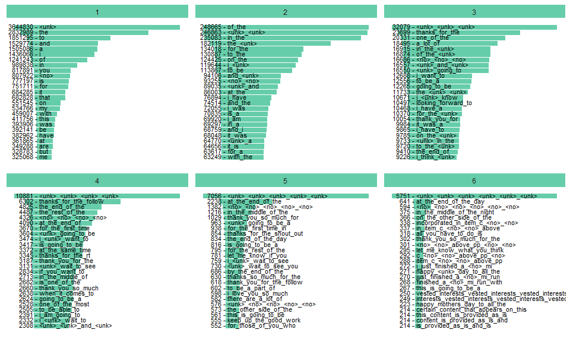
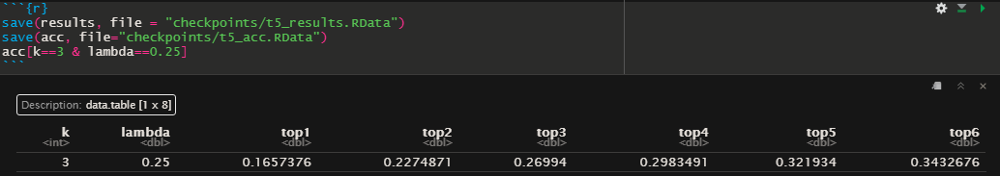

```{r setup, include=FALSE}
knitr::opts_chunk$set(echo = FALSE)
```

## Executive Summary

In this presentation we are going to look into my Capstone Project for the John Hopkins Coursera Data Science Specialization course.

This project has produced three relevant results:

 1. A library that can be used to train a similar algorithm using your own dataset;
 1. The training of a next word prediction algorithm with more than 30% accuracy;
 1. An app that, not only demonstrate the algorithm, but can also be used as a funny nonsense text generator.
 
The data used to develop and train the algorithm was the EN-US datasets that can be found  [here](https://d396qusza40orc.cloudfront.net/dsscapstone/dataset/Coursera-SwiftKey.zip).

You can get access to the model and all the code necessary to train your own model by installing my package through the command:

```r
devtools::install_github("Harnkal/ngkm")
```

All the necessary documentation accompany the package.

 
## The Dataset preparation

Differently from what most people has done, I decided not to remove the numbers, urls and non English words. I opted for replacing then with dummy tokens. This way, although the algorithm may not predict such tokens, it is able to take them into consideration when predicting.

```{r echo=FALSE, fig.align='center', out.width=800, out.height=480}

```

## The Algorithm

The predictive algorithm implemented in this app was inspired in the Katz Backoff model with a small difference.  

While the Katz backoff model only considers the lower a lower level ngram if the higher level ngram is not present. In this model, when calculating the probability of a word, the probability of all ngram levels is calculated, these probabilities are then adjusted according to their ngram level and the maximum value is selected.

As I am not that good with words, here goes an example. Given an trigram Katz backoff model, the probability of a word given its last 2 words would be calculated as follows:

$$
\hat{P}(W_{i}|W_{i-2} W_{i-1}) =
\begin{cases}
P(W_{i} | W_{i-2} W_{i-1}) & \quad \text{when $C(W_{i-2} W_{i-1} W_{i}) > 0$ }\\
\alpha_{1}P(W_{i} | W_{i-2}) & \quad \text{when $C(W_{i-2} W_{i-1} W_{i}) = 0$ & $C(W_{i-1} W_{i}) > 0$}\\
\alpha_{2}P(W_{i}) & \quad \text{otherwise}\\
\end{cases}
$$

In this model, the probability of a word given its last 2 words is calculated as follows:

$$
\hat{P}(W_{i} | W_{i-2} W_{i-1}) = \max (P(W_{i} | W_{i-2} W_{i-1}),\lambda P(W_{i} | W_{i-2}), \lambda^2 P(W_{i}))
$$

This changes very little in the results as the alpha factor, which for some reason I called lambda in the package I created, unless close to or bigger than one, will prevent the probability of a lesser level to outweight the higher values.

## The training parameters

Besides the backoff, we also had some to cut some ngrams to allow the model to fit in this app. Only ngrams that appeared more than 2 times in the training data are considered in the model. This cutoff value is defined as k.

Finally, the number of predictions the model returns can also be selected. I arbitrarily selected 6 as the number of predictions. Of course, the more predictions I add the more accurate my model is, but at some point this starts getting quite cumbersome. 

To train the algorithm a DOE was made and the values defined for the final training were:

 - **ngrams**: 5;
 - **lambda**: 0.25;
 - **k**: 3;
 - **npred**: 6.

The predictions return in about a second. Here are the accuracy values for different numbers of predictions.



## The App

The app is very simple and is basically divided in three areas that allow you to:

 - Input your text;
 - Visualize the output;
 - Control the model and the app behavior.
 
The app also includes what I called, the nonsense mode, in which everytime you press space a new word will be added from the predictions into the input text. The selection method of which word predicted is going to endup in the text can also be controlled.

Here are some cool generated text from the nonsense mode:

 - the best way to make people remember you, borrow money (I swear it was generated by the algorithm, I only added the comma)
 - the first day back after i got my hair is long over due for release from school
 - of the year award for most it is the most amazing and we are so thankful (this one sound like some politician speech)

All of these are random but you can have a mix with your own text, go and have fun!